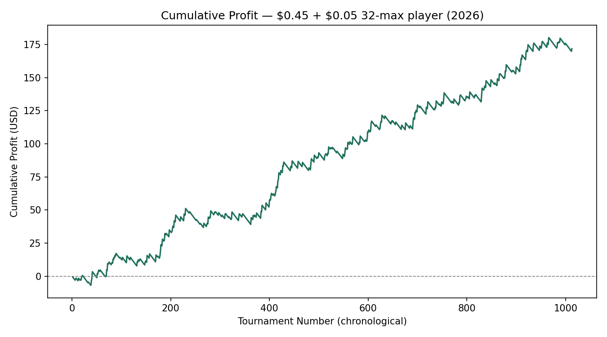
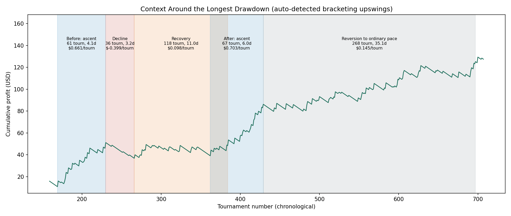

# Micro-stakes Tournament Poker Performance Analysis
Grinding 1014 micro-stakes 32-player tournaments on Poker Stars resulted in a very high **33.78% ROI**.
[poker_analysis_report.md](https://github.com/user-attachments/files/32456907/poker_analysis_report.md)

**Player:** zzombee 
**Site:** PokerStars 
**Tournament Type:** $0.50 buy-in ($0.45 + $0.05 fee), 32-max player, turbo 
**Sample:** 1,014 tournaments played April 18 – August 20, 2026 

---
## Headline Results

- **33.78% ROI** for **$171.27 net profit** over 1,014 tournaments at $507.00 staked
- returning **$0.49 per hour** over 347.7 hours over 311 sessions and a 124-day calendar span
- **scalable +0.98 buy-ins per hour**

## 1. Payout Structure

The tournaments have the following fixed-payout structure:

| Place | Payout | % of Prize Pool |
|---|---|---|
| 1st | $5.67 | 39.4% |
| 2nd | $3.70 | 25.7% |
| 3rd | $2.42 | 16.8% |
| 4th | $1.58 | 11.0% |
| 5th | $1.03 | 7.2% |
| 6th–32nd | $0.00 | — |

The total prize pool is $14.40 (32  players × $0.45).

---

## 1. Cumulative Profit
The cumulative graph of profit/loss shows a steady upward trend.

## 2. The Edge: Finish Position
In a 32-person tournament the expectation by chance finishing in any given place is 1/32 = 3.12%. Below is a cumulative graph of actual finishing positions on the left, also the same summarized by quartiles on the right:

We see a distribution weighted towards 1st-place and overall higher place finishes.
- **1st-place finishes: 61/1014 = 6.02%** are observed at roughly double the 3.12% expected by chance. (z-score = 5.29 indicates a very strong signal.)
- **In-the-money rate: 213/1014 = 21.01%** vs. 15.62% expected. (z-score = 4.72 indicates a very strong signal)
- **Bottom quartile (25th–32nd): 100.4 observed vs. 253.5 expected (z-score = −11.11).** This is the single largest deviation from chance anywhere in the data, indicating a strong, consistent tendency to avoid the worst finishing places.
- Top quartile (1st–8th): z = +5.48. Middle quartiles both modestly above chance as well.

**Read together**: 'I am most likely to finish 1st.' and 'I rarely bust early.' 

---

## 3. Expected ROI
**What might a future ROI be over a similar number of tournaments be?** Using bootstrap sampling and a confidence interval of 95% (bootstrap CI 95%), I estimate that such a run of tournaments is quite likely (19 out of 20 times) to show an ROI between 15.2% and 52.9%, well above 0.0%. Below is a graph of the distribution of ROIs in such an analysis.

---

## 4. Envisioning the Long-Run
Using bootstrap analysis we can visualize expected ROI in the short and long-runs. The graph below is the result of numerous bootstrap CI 95% analyses over increasing numbers of tournaments. So, for a certain number of tournaments, the uppermost and lowermost values of the shaded region define the uppermost and lowermost expected ROIs with 95% confidence. Again, for a certain number of tournaments, 19 out of 20 times the ROI will be in the shaded region. In the short-run, ROI variance is much greater, and can go negative. The larger the window, the more stable ROI is expected to be, tending towards a nice, juicy positive number around 30%. 
At only 25 tournaments, there's a 31% chance of showing an overall loss purely from variance. That drops to 6% by 200 tournaments. It is effectively negligible by 700+. Results of smaller groups of tournament results should be read with this in mind, as when I ask myself: Do I feel lucky? Well, do I? A. Irrelevant.

---

## 5. Swings: How Often, How Long?

Going from a bankroll low-point to a high point or vice versa is a swing. Since that is always happening, how often that switches from one to the other depends on how many buy-ins up or down you consider a swing. For example, we might say we have to go down or up a minimum of 10 buy-ins for a swing. The graph below shows the result of using a ZigZag technique on the cumulative profit curve with no smoothing, no random baseline, and one parameter (minimum swing size =10).

At a 10-buy-in ($5) minimum swing threshold we see **53 pivots**, meaning 26 ups and 26 downs. The mean gap is 18.8 tournaments. Due to tournament format and playing style, both up and down swings are essentially symmetric (downswings mean 19.4, upswings mean 18.1). This changes dependent on what is considered a swing. At 5 buy-ins the mean gap drops to ~9 tournaments, while at 20 buy-ins it is over 100.

---

## 7. Longest Drawdown: Context

The single longest drawdown ran **154 tournaments over 14.2 days** (May 26 – June 9) was also the deepest at −$14.36 (almost 30 buy-ins). The drawdown was split into a sharp decline and a recovery phase. It is the phase shadeded red to pink to purplish.

- **Sharp Decline (peak → trough): 36 tournaments, 3.2 days** — the $14.36 loss happened here
- **Recovery (trough → back to prior peak): 118 tournaments, 11.0 days** — a slow grind with a flattened profit curve. The final dip ending at tournament 361 is marked by the transition from red to purple shading in the right part of the Recovery phase on the graph.

### Context: Good News All Around

The upswings immediately before and after this drawdown, labeled Before: Ascent and After: Ascent, are, respectively, the **2nd-longest and longest** sustained upswings in the entire 1,014-tournament history. The period following reverts to essentially the career-average pace ($0.145–0.157/tournament vs. $0.169 overall). So, the longest longest observed drawdown was book-ended by the good news of solid upswings.

*Note: with only 67 drawdown episodes and 26 upswings observed so far, "100th percentile" mainly means "the largest one seen to date" — this classification is expected to shift, in either direction, as more tournaments are played.*

---

## 9. Data Limitations

**On "Place: 0" finishes** (5 of 1,014 tournaments, under 0.5% of cases):

> What are recorded as 0-place finishes are not well-defined. I assume for analysis that they are early bust-outs.
> They represent finishes before the tournament reached full-registration. These are losses, amongst the earliest bust-outs.
> They are well-defined in time, but several players could have the same 'finishing place'.
> We account for these 0-place finishes by modeling them as evenly distributed amongst the worst half of losing positions.
> This likely over-emphasizes the worst finishing positions, such as last place.
> We are certain they are early losses of 1 unit buy-in. They are less than .5% of cases.
> They are a certain rare limited loss.

---

*Analysis pipeline built in Python (pandas, numpy, scipy, matplotlib). Full methodology and source available on request.*
