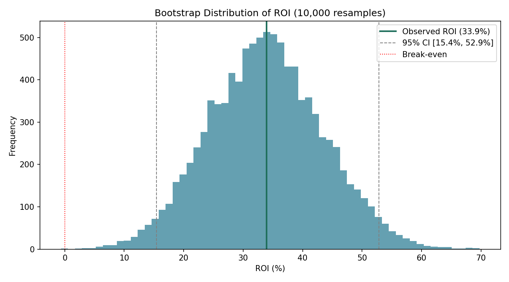
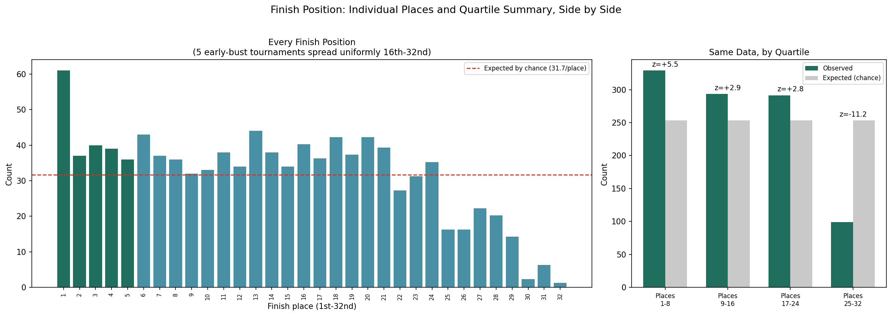
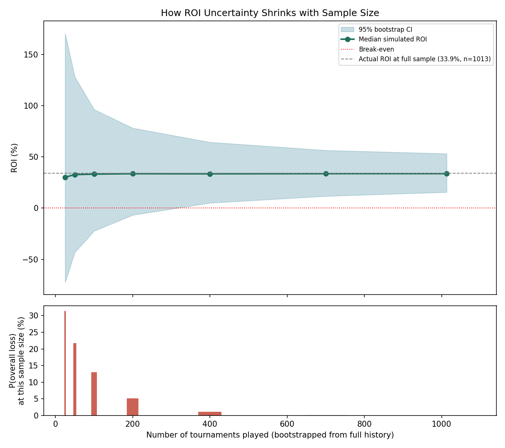
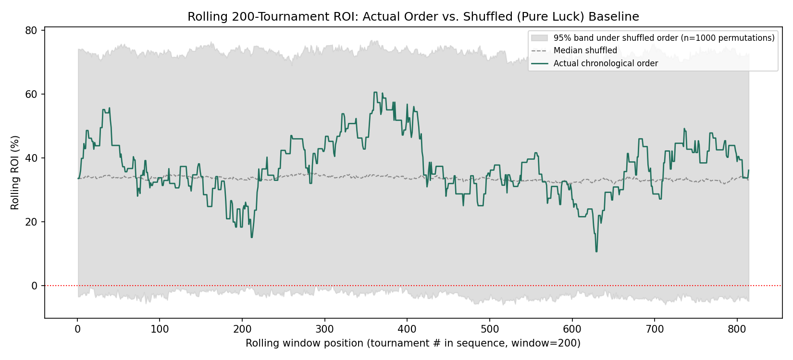
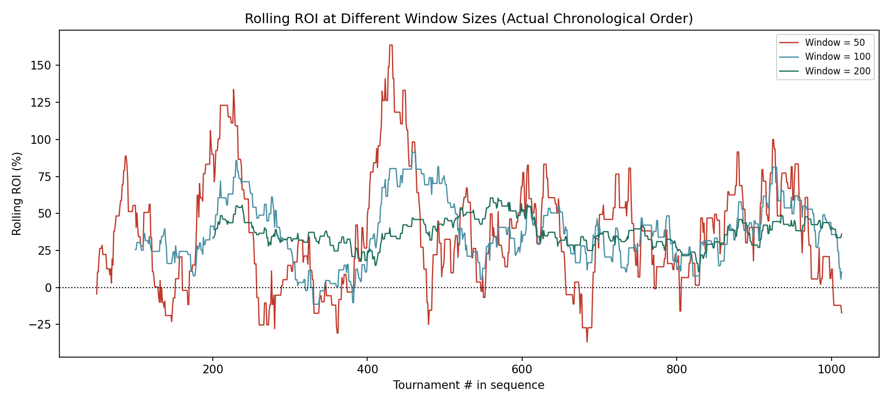
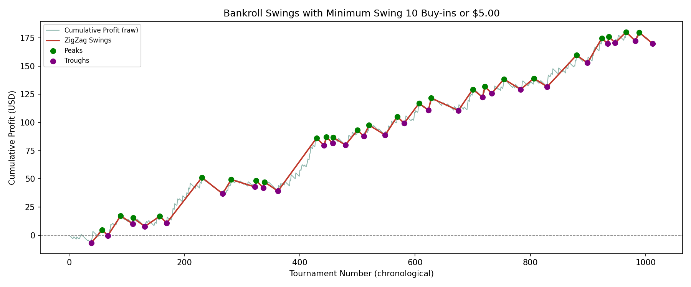
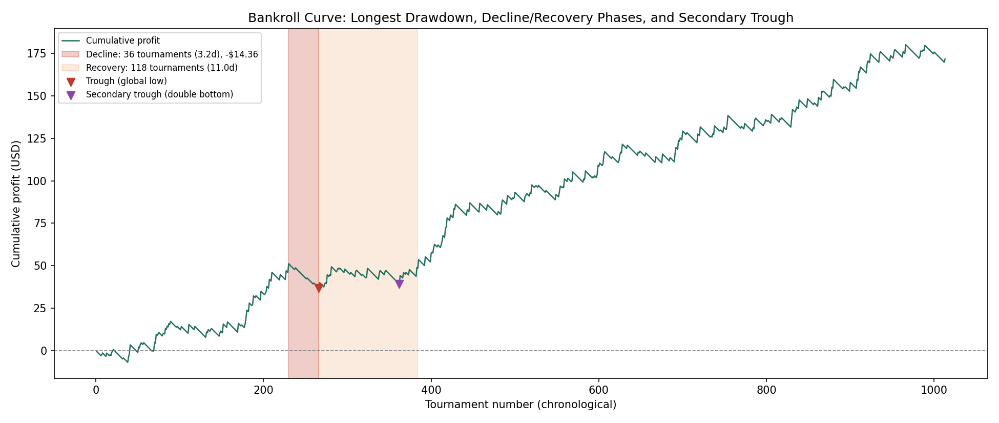

# Micro-stakes Tournament Poker Performance Analysis
Grinding 1014 micro-stakes 32-player tournaments on Poker Stars resulted in a very high **33.78% ROI**.
[poker_analysis_report.md](https://github.com/user-attachments/files/32456907/poker_analysis_report.md)

**Player:** zzombee **Site:** PokerStars
**Scope:** $0.45 + $0.05 buy-in + fee, 32-max player, turbo
**Sample:** 1,014 tournaments, April 18 – August 20, 2026

---
## Headline Results

- **33.78% ROI** for **$171.27 net profit** over 1,014 tournaments at $507.00 staked
- returning **$0.49 per hour** over 347.7 hours across 311 separate play sessions over a 124-day calendar span
- which is a **scalable +0.98 buy-ins per hour** while playing an average of 1.82 tables at a time at that stake.

## 1. Payout Structure

A fixed, unchanging payout table across all 1,014 tournaments (32 entrants, 5 paid):

| Place | Payout | % of Prize Pool |
|---|---|---|
| 1st | $5.67 | 39.4% |
| 2nd | $3.70 | 25.7% |
| 3rd | $2.42 | 16.8% |
| 4th | $1.58 | 11.0% |
| 5th | $1.03 | 7.2% |
| 6th–32nd | $0.00 | — |

Payouts sum exactly to the $14.40 prize pool (32 × $0.45 net of the site's $0.05/entrant rake). Buy-in is $0.50 per entry; net result per tournament = payout − $0.50.

---

- **Bootstrap 95% confidence interval on ROI: [15.27%, 52.89%]** — the entire interval stays above 0%, consistent with a real edge rather than pure variance.

---

## 3. Finish Position: Where the Edge Actually Shows Up

Every finish position (1st–32nd), compared to what pure random chance would produce, alongside the same data summarized by quartile of the field:

- **1st-place rate: 61/1014 = 6.02%**, roughly double the 3.12% expected by chance (z = 5.29)
- **In-the-money rate: 213/1014 = 21.01%**, vs. 15.62% expected (z = 4.72)
- **Bottom quartile (25th–32nd): 100.4 observed vs. 253.5 expected — z = −11.11.** This is the single largest deviation from chance anywhere in the data: a strong, consistent tendency to avoid the very worst finishes, not just a tendency to occasionally win big.
- Top quartile (1st–8th): z = +5.48. Middle quartiles both modestly above chance as well.

**Read together**, the full histogram and the quartile summary rule out two competing stories: this isn't "occasional lucky wins offset by routine early busts" (the suppressed bottom quartile rules that out), and it isn't "grinds steadily but never closes" (the 1st-place spike and strong top quartile rule that out too). What's left is a specific, falsifiable claim: rarely blows up early, and disproportionately converts deep runs into wins.

---

## 4. Sample Size: Why Short Stretches Can Mislead

At only 25 tournaments, there's a 31% chance of showing an overall loss purely from variance, despite the real underlying edge. That drops to 6% by 200 tournaments and is effectively negligible by 700+. Small-sample results — a bad week, a good week — should be read with this in mind.

---

## 5. Does Chronological Order Matter? (Streakiness Check)

Comparing the actual, chronologically-ordered 200-tournament rolling ROI against 1,000 random reshuffles of the same results:

The real sequence's volatility ranks at just the 1st percentile among shuffled versions — **less volatile than 99% of random reorderings of the same results.** This is mild evidence of unusually smooth, consistent performance over time, though it's a modest signal (not proof of a specific cause like fatigue or tilt — or its absence).

---

## 6. Bankroll Swings: How Long Do Upswings and Downswings Last?

Using a standard equity-curve technique (ZigZag) applied directly to the real cumulative profit curve — no smoothing, no random baseline, one interpretable parameter (minimum swing size):

At a 10-buy-in ($5) minimum swing threshold: **53 pivots, mean gap 18.8 tournaments, median 18.0** — both up and down swings, essentially symmetric (downswings mean 19.4, upswings mean 18.1). This is sensitive to the threshold choice; at 5 buy-ins the typical gap drops to ~9 tournaments, at 20 buy-ins it rises past 100. Reported explicitly rather than picking one number silently.

---

## 7. The Longest Drawdown, In Detail

The single longest drawdown (≥$5 deep) ran **154 tournaments over 14.2 days** (May 26 – June 9), and is also the **deepest** drawdown in the entire dataset (−$14.36) — not just the longest.

Split into phases, the shape is more specific than "slow plod downward":

- **Decline (peak → trough): 36 tournaments, 3.2 days** — the entire $14.36 loss happened here
- **Recovery (trough → back to prior peak): 118 tournaments, 11.0 days** — a slow grind back to even, not continued losing
- A secondary, nearly-as-deep low ("double bottom") occurs mid-recovery at tournament 361 ($39.11) — only $2.29 above the global trough — after a partial bounce that didn't hold

The decline was sharp and fast; the bulk of the duration was the patient recovery, not the drop itself.

### Context: what brackets this drawdown

The upswings immediately before and after this drawdown are, respectively, the **2nd-longest and longest** sustained upswings in the entire 1,014-tournament history (both auto-detected, ranked at the 96th and 100th percentile among all 26 upswings observed to date). The period following reverts to essentially the career-average pace ($0.145–0.157/tournament vs. $0.169 overall).

*Note: with only 67 drawdown episodes and 26 upswings observed so far, "100th percentile" mainly means "the largest one seen to date" — this classification is expected to shift, in either direction, as more tournaments are played.*

---

## 8. Worst-Case Losing Streaks (Reference)

| Length | Duration | Lost | Dates |
|---|---|---|---|
| 16 in a row | 0.8 days | $8.00 | Jun 7–8 |
| 16 in a row | 1.1 days | $8.00 | Aug 18–19 |
| 15 in a row | 2.1 days | $7.50 | Jul 22–24 |
| 13 in a row | 0.2 days | $6.50 | May 19 |
| 13 in a row | 1.1 days | $6.50 | May 26–28 |

These are simple worst-case facts, not statistical findings — a run of 16 non-cashing tournaments isn't an unusual outlier at this field size and 1st-place rate over 1,014 tournaments. Included for practical/psychological reference (the actual worst case experienced), not because it's structurally distinct in the bankroll curve.

---

## 9. Data Limitations

**On "Place: 0" finishes** (5 of 1,014 tournaments, under 0.5% of cases):

> What are recorded as 0-place finishes are not well-defined. I assume for calculation that they are early bust-outs.
> They represent finishes before the tournament reached full-registration. These are losses, amongst the worst positions.
> They are well-defined in time, but several players could have the same 'finishing place'.
> We account for these 0-place finishes by modeling them as evenly distributed amongst the worst half of losing positions.
> This likely over-emphasizes the worst finishing positions, such as last place.
> We are certain they are early losses of 1 unit buy-in. They are less than .5% of cases.
> A down-sloping line or non-linear curve might be a more accurate model. 'I rarely bust early.' also works.
> Assumption: They are a certain rare limited loss.

---

*Analysis pipeline built in Python (pandas, numpy, scipy, matplotlib). Full methodology and source available on request.*
